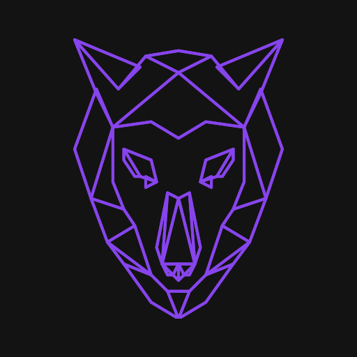

<h1 align="center">
 
  
 
  
 Wildbeast
</h1>

 

##  **
 <h2  align="center"> Aplicação front end 📟 👨‍💻 </h2> 
**

## 
 <h2 align="center">Wildbeast é um projeto que foi desenvolvido no curso de CSS Grid Layout da [Origamid](https://www.origamid.com/) e eu reestruturei o seu CSS utilizando Less</h2> 

# **Aplicação Web** 💻

  

# **Demonstração do código** 

  

## 🚀 Tecnologias utilizadas:

 ## **
Iniciando a caminhada para poder participar da maratona nesse mundo da programação 🏃‍
**

 ### 
 <h2 align="center"> Mais uma aplicação realizada por Matheus da Cruz 👨‍💻 </h2> 

